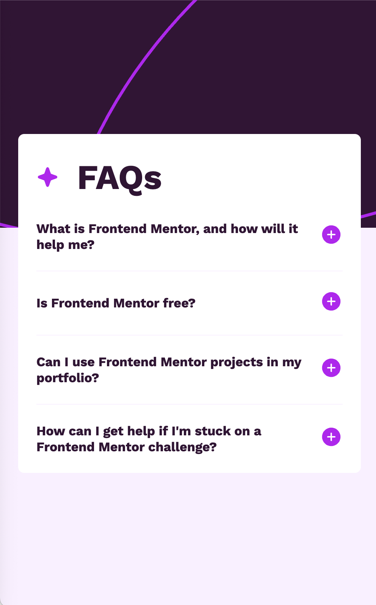

# Frontend Mentor - FAQ accordion solution

This is a solution to the [FAQ accordion challenge on Frontend Mentor](https://www.frontendmentor.io/challenges/faq-accordion-wyfFdeBwBz). Frontend Mentor challenges help you improve your coding skills by building realistic projects.

## Table of contents

- [Frontend Mentor - FAQ accordion solution](#frontend-mentor---faq-accordion-solution)
  - [Table of contents](#table-of-contents)
  - [Overview](#overview)
    - [The challenge](#the-challenge)
    - [Screenshot](#screenshot)
    - [Links](#links)
  - [My process](#my-process)
    - [Built with](#built-with)
    - [What I learned](#what-i-learned)
    - [Continued development](#continued-development)
    - [Useful resources](#useful-resources)
  - [Author](#author)

## Overview

### The challenge

Users should be able to:

-   Hide/Show the answer to a question when the question is clicked
-   Navigate the questions and hide/show answers using keyboard navigation alone
-   View the optimal layout for the interface depending on their device's screen size
-   See hover and focus states for all interactive elements on the page

### Screenshot

### Links

-   Solution URL: [https://github.com/EmLopezDev/FAQ-Accordion](https://github.com/EmLopezDev/FAQ-Accordion)
-   Live Site URL: [https://emlopezdev.github.io/FAQ-Accordion/](https://emlopezdev.github.io/FAQ-Accordion/)

## My process

### Built with

-   Semantic HTML5 markup
-   SCSS custom properties, functions and mixins
-   Flexbox
-   Mobile-first workflow

### What I learned

-   I knew the `
` tag has built in open and close functionality, so I wanted to leverage that and create this componente without JS.
-   The `
` tag has an `:open` attribute that you can use in css to make changes when it is open.

### Continued development

-   I want to continue creating simple and minimal solutions. Yes I could have used JS to build this and maybe I should have to test my knowledge, but I was able to create a solution that leveraged native elements and their functionalities. Because of that this page will load faster and be less prone to bugs.

### Useful resources

-   [Details Tag](https://developer.mozilla.org/en-US/docs/Web/HTML/Reference/Elements/details) - This helped with learning how to change the CSS of the details tag when it is open
-   [Details Animation](https://www.youtube.com/watch?v=Vzj3jSUbMtI) - Fun tutorial on how to add css animation to details tag

## Author

-   Frontend Mentor - [@EmLopezDev](https://www.frontendmentor.io/profile/EmLopezDev)
